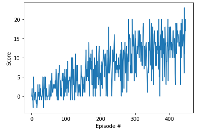

# Report 
## Used Framework 
In this project, we are using PyTorch framework. [PyTorch](https://pytorch.org/) is an optimized tensor library for deep learning using GPUs and CPUs.
It offers several layers and filters to implement all deep learning models. 

## Learning Algorithm 
#### Deep Q Networks )
This project implements a [Value Based method](https://medium.com/@jonathan_hui/rl-value-learning-24f52b49c36d) called Deep Q Networks. 
In deep Q Networks, we use a neural network to approximate the Q-value function. The state is given as the input and the Q-value of all possible actions is generated as the output. 

In this case, the use of this algorithm has these advantages : 
* The size of the state is 37. Thus, the memory and computation to use like a simple Q-learning method would be too high. DQN helps us address that kind of problem by using : 

  1. **Experience Replay** : Which assure a more efficient use of previous experience by learning with it multiple times and a better convergence behaviour when training the Q function approximator. In addition, it ensures that the learning is not biased by randomizing the subset from which the agent learns. 
  
  2. **Fixed Q-targets** : This feature, consist on having two neural networks : One to update the Q function and the other one is used to approximate it. And the synchronization is done slightly between them with the soft_update function. It ensures that the learning process stable. 

#### Solution 
In this first shot solution, we are using [Vanilla Deep Q Learning](https://arxiv.org/pdf/1312.5602.pdf). As input to the neural network, the vector of state is used. Thus, no need for convolution layers we just use a fully connected neural network. 
A fully connected neural network with 3 layers is implemented : 
* Input : 37 (Size of the state) ---> Output : 128
* Input : 128 ---> Output : 64
* Input : 64  ---> Output :  4 (Action size)

DQN algorithm's parameters : 
* Maximum steps per episode: 4000
* Starting epsilion: 1.0
* Ending epsilion: 0.01
* Epsilion decay rate: 0.999


## Results 
 
```
Episode 100	Average Score: 1.63

Episode 200	Average Score: 4.92

Episode 300	Average Score: 8.82

Episode 400	Average Score: 11.77

Episode 447	Average Score: 13.03

Environment solved in 347 episodes!	Average Score: 13.03
``
## Ideas for Future Work 
* Implement a Double Deep Q Network 
* Prioritized Experience Replay
* Dueling Deep Q Networks
* Complete the optional part to directly use the pixels using a convolutional network. 
